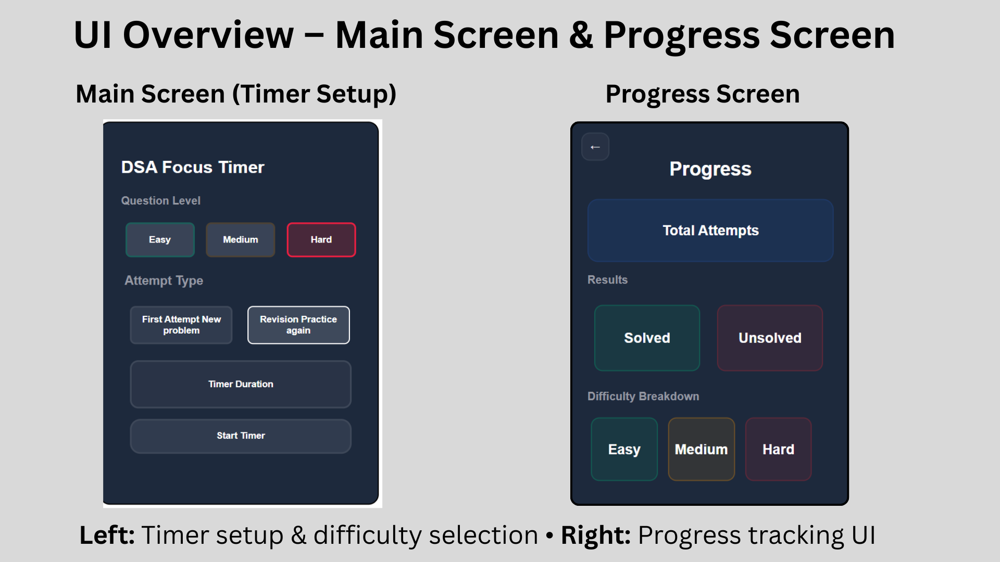

# ⏱️ AlgoClock — DSA Timer Chrome Extension

AlgoClock is a **minimal, purpose-built Chrome extension** designed to help **DSA and competitive programming learners** stay focused, disciplined, and consistent during problem-solving sessions.

It is not a generic timer.  
It is a **focus tool built around how DSA is actually practiced**.

---

## 🚀 Why AlgoClock?

While preparing for exams and daily DSA practice, I noticed that:
- Generic timers don’t respect problem difficulty
- Context switching breaks deep focus
- Consistency matters more than motivation

**AlgoClock was built to solve this exact problem** — helping learners sit down, focus deeply, and finish what they start.

---

## ✨ Features (v1 — Current Release)

- ⏳ Clean, distraction-free focus timer  
- 🧠 Designed specifically for DSA problem-solving sessions  
- 💾 Local Storage based (no login, no data tracking)  
- ⚡ Lightweight Chrome extension  
- 🎯 Minimal UI focused on clarity and usability  

Version 1 focuses on **delivering a stable and usable core experience**.

---

## 🧩 How to Use

1. Clone or download this repository  
2. Open Chrome and go to `chrome://extensions/`  
3. Enable **Developer Mode** (top-right corner)  
4. Click **Load unpacked**  
5. Select the `AlgoClock_V1` folder  
6. Open the extension and start your focused DSA session

---

## 🛠️ Tech Stack

- HTML  
- CSS  
- Vanilla JavaScript  
- Chrome Extensions API  
- Browser Local Storage  

---

## 📦 Versioning & Roadmap

### ✅ Version 1 (Current)
- Functional and stable release  
- Core timer logic implemented  
- Focus on usability and clean workflow  

> v1 prioritizes **working software over perfection**.

### 🚧 Version 2 (Planned)
- Cleaner internal architecture  
- Improved state handling  
- Advanced focus & productivity features  
- Better insights and session tracking  

v2 will focus on **refinement, scalability, and better learning feedback**.

---

## 🌱 What This Project Represents

AlgoClock is part of my journey to:
- Learn JavaScript deeply  
- Build real, usable products  
- Follow an iterative, engineer-first mindset  

This project will evolve with time — just like its creator.

---

## 👤 Author

**Ayushi**  
B.Tech CSE  
Learning by building • Focused on strong fundamentals & real-world projects

---

⭐ If you find this useful, feel free to explore, experiment, or share feedback.
