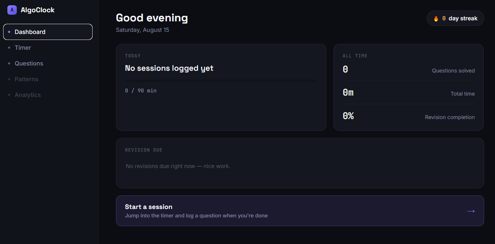
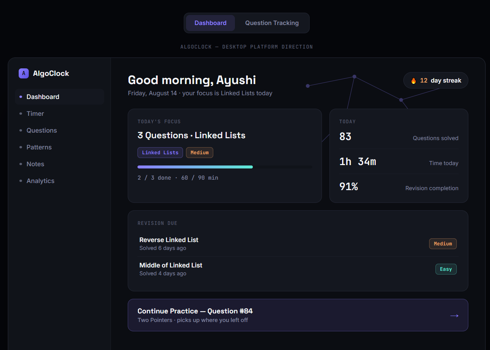

# ⏱️ AlgoClock

### The browser home for serious DSA learners.


**[Live Demo →](https://algo-clock-dsa-platform.vercel.app)**

---

## Screenshots

**Current — v1, live now**

*This is what's actually deployed and working today.*

**Vision — where this is heading**

*A design exploration for the full desktop-platform version. Not built yet — see the Roadmap section further down.*

---

## The problem

Every DSA learner ends up running the same fragmented workflow:

LeetCode for problems → YouTube for explanations → ChatGPT for answers you didn't earn →
Notion for notes → a separate timer for focus → and no single place that remembers
any of it a month later.

The result isn't a lack of effort. It's that **nothing compounds.** You can solve 200
questions and still forget half of them, because nothing forces revision and nothing
connects "what I solved" to "what I actually understood."

## The idea

**AlgoClock replaces the fragmentation, not the platforms you already use.**

Instead of another tab you have to remember to open, AlgoClock is built to become
the tab that's already open — the single browser home where you practice, track,
revise, and eventually learn from what other learners have figured out before you.

> *AlgoClock should become the browser home for DSA learners — not only to practice
> questions, but to collect, organize, revisit, and eventually contribute knowledge
> that helps the entire community learn better.*

---

## ✨ What's built (v1)

- **Dashboard** — today's focus, streak, time studied, and revision suggestions, all in one glance
- **Focus Timer** — Easy/Medium/Hard presets (25/45/60 min), start/pause/end, session logging
- **Question Tracking** — log every question with platform, difficulty, pattern, confidence, and personal notes
- **Streak tracking** — computed from real session history, not a manually-incremented counter
- **Revision surfacing** — low-confidence questions automatically resurface on the dashboard
- **Local-first** — everything lives in your browser's local storage. No account, no server, no data leaving your machine

v1 deliberately does **not** include an AI mentor, platform scraping, or community
features yet — see [Roadmap](#-roadmap) for why, and when.

---

## 🧠 Design philosophy

From the product vision doc this project is built against:

> Every feature must reduce learning friction — not learning itself.

Concretely, that means:
- The AI mentor (when it ships) will **never hand over a full solution first** — hints escalate, and the goal is understanding, not autocomplete
- No feature ships just because it's easy to bolt on — the dashboard exists to answer one question: *"what should I do today?"*
- Community contribution (future) starts with **collections**, not uploads — validating that people want to curate before taking on moderation and storage costs

---

## 🛠️ Tech stack

- HTML / CSS / Vanilla JavaScript — no framework, deliberately
- `localStorage` for all persistence (questions, sessions, streak)
- Deployed on [Vercel](https://vercel.com)
- Type system: Space Grotesk (display), Inter (body), JetBrains Mono (data/timer)

No backend, no API keys, no build step. The whole point of v1 is that it works
entirely on data the user generates themselves.

---

## 🚀 Running it locally

```bash
git clone https://github.com/Ayushi-Maurya2904/AlgoClock-DSA-Platform-.git
cd AlgoClock-DSA-Platform-
```

Then just open `index.html` in a browser — no install, no build step.

Or serve it locally for a closer-to-production feel:
```bash
python3 -m http.server 8000
# visit localhost:8000
```

---

## 📦 Roadmap

| Version | Focus |
|---|---|
| **v1** ✅ | Dashboard, timer, question tracking, streak, local storage |
| **v2** | Chrome extension — new-tab override, so AlgoClock *is* the browser, not a tab in it |
| **v3** | Pattern tracker, deeper analytics, spaced-repetition revision engine |
| **v4** | AI Mentor — hint-escalation only, never a first-response answer |
| **v5** | Community knowledge layer — shared notes, pattern summaries, curated collections |

Each version ships as a working product before the next one starts. No feature
gets pulled forward just because it's exciting to build.

---

## 🌱 Why this exists

This is part of an ongoing effort to learn by building real, usable software —
not tutorials, not toy projects. AlgoClock is being built iteratively, in public,
with an actual user (me) validating every version before the next one starts.

---

## 👤 Author

**Ayushi Maurya**
B.Tech CSE · Learning by building · Focused on strong fundamentals & real-world products

---

⭐ If this is useful to you or you're building something similar, feel free to explore,
fork, or share feedback.
